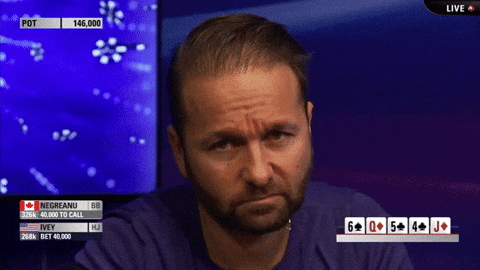

# Poker-CV Project

A computer vision–powered poker board analyzer that detects community cards from an uploaded photo, takes in user-input hole cards, evaluates hand strength, and suggests an action (**fold/call/raise**) based on game context.
Built with **YOLOv8**, **ResNet18**, and **Treys**, deployed via **Streamlit** and **Docker**.

This project combines my interests in poker and computer vision.




---

## Features

* **Community card detection** – YOLOv8 trained on custom Roboflow-labeled images.
* **Card classification** – Fine-tuned ResNet18 model (Kaggle + custom photos).
* **Poker logic** – Treys-based hand evaluation + decision engine (fold/call/raise).
* **Streamlit interface** – Upload a board photo, input hole cards, and get instant advice.
* **Production-ready** – Dockerized for deployment on Streamlit Cloud, AWS, or other hosts.

---

## Tools & Technologies

* **CV & ML:** YOLOv8 (Ultralytics), PyTorch, TorchVision, ResNet18
* **Poker Evaluation:** Treys library
* **Data:** Roboflow (labeling), Kaggle (classifier training)
* **Web:** Streamlit, Docker, AWS Elastic Beanstalk
* **Other:** `torch`, `torchvision`, `pillow`, `numpy`, `ipython`

---

## Model Training

<details>
<summary>Click to expand</summary>

* **YOLOv8:**

  * Dataset: Roboflow-labeled poker boards
  * Validation: **94% mAP\@0.5**
* **ResNet18:**

  * Dataset: Kaggle 53-class card images (Joker excluded)
  * Validation: **92% accuracy**
* **Poker Logic:**

  * Treys hand evaluation
  * Decision-making: incorporates hand score, pot odds, number of players, and board stage

</details>

---

## Pipeline (`run_hand_analysis`)

1. Detect community cards (YOLOv8).
2. Classify cropped cards (ResNet18).
3. Convert results to Treys format.
4. Evaluate hand strength (Treys).
5. Compute pot odds & make decision.
6. Output action + explanation.

---

## Running Locally

```bash
git clone https://github.com/ethngo7/poker-cv-project.git
cd poker-cv-project
pip install -r requirements.txt
streamlit run streamlit_app.py
```

Visit [http://localhost:8501](http://localhost:8501).

---

## Deployment

* **Streamlit Cloud:** [https://ethanspokercv.streamlit.app/](https://ethanspokercv.streamlit.app/)
* **Docker:**

  ```bash
  docker build -t poker-cv-app .
  docker run -p 8501:8501 poker-cv-app
  ```
* **AWS Elastic Beanstalk:** In progress (scaling setup).

---

## Repo Structure

* `utils/` – Core pipeline & poker logic
* `models/` – Pretrained YOLOv8 (`best.pt`) & ResNet18 classifier
* `originalworkincolab/` – Raw Google Colab notebooks (training & experiments)
* `requirements/` – Dependency lists for different environments

---

## Future Improvement 

* Improve Streamlit UI.
* Add **equity simulations** (Monte Carlo win rates).
* Fully deploy to **AWS Elastic Beanstalk**.
* Build **mobile version** for on-the-go use.
* Integrate **board texture & draw detection** for nuanced advice.

---
